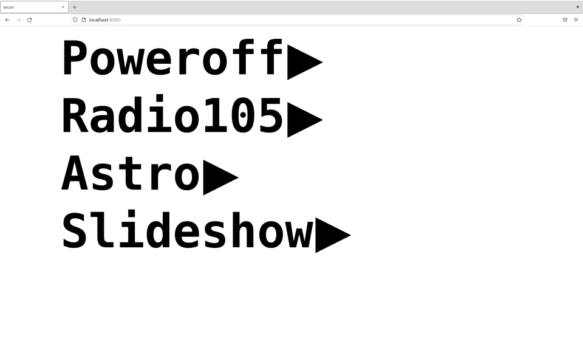

# Wcon

Wcon is a simple task manager with a web interface. I use it to control simple
tasks running on my raspberries. Examples are music players, slide shows to projector,
simple audio services etc. It uses a simple json configuration file:

```
[
  {
    "Name": "task display name",
    "Exec": "bash -c this",
    "Dir":  "working directory"
   },
   ...
]
```

The web server listens at `host:port` and presents a simple UI to start/stop tasks.
Usually i start it with systemd on boot.

## Installation

`go install github.com/anastasop/wcon@latest`

## Usage

Write a simple configuration file `progs.json` like the following

```
[
    {
	"Name": "Poweroff",
	"Exec": "/sbin/poweroff"
    },
    {
	"Name": "Radio105",
	"Exec": "vlc -I dummy https://icy.unitedradio.it/Radio105.aac"
    },
    {
	"Name": "Astro",
	"Exec": "/usr/local/plan9/bin/astro -s | espeak"
    },
    {
	"Name": "Slideshow",
	"Exec": "feh -F -D 2 --on-last-slide resume",
	"Dir": "/home/anastasop/photos"
    }
]
```

Start the server with `wcon -l :8080 -c ./progs.json`

Point the browser at `localhost:8080`


Use the start/stop buttons to manipulate the tasks.

## License

Wcon is released under the GNU public license version 3.

## Bugs

The UI is simplistic and tailored for my screens.
